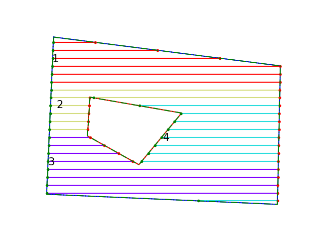
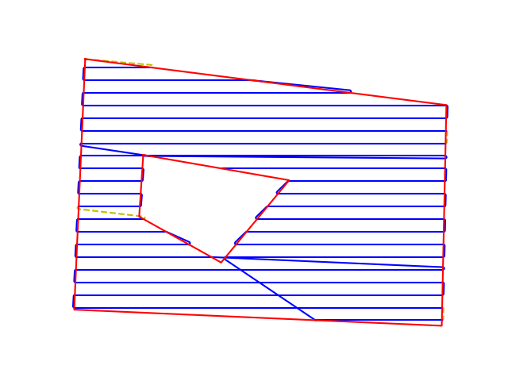

# What does it do?

Path planning is an important aspect of robotics where the goal is to determine a suitable path in space while satisfying certain conditions. In coverage path planning, the goal is to find a path that traverses through every cell or node in a given region of interest. It has many diverse applications in robotics such as cleaning, agriculture, and search and rescue. This repository contains software to generate guidance trajectories that enable the robot to cover the specified region of interest using boustrophedon or lawn-mower motions. It uses an area-based approach using lat-lon coordinates as opposed to a grid-map based approach that is used in most studies, which enables easy transfer to real-life applications. If the area of interest (AoI) is large or if it has any forbidden regions or obstacles, it could be divided into smaller sections and covered one after the other. The order of visits to the sections is optimized using a TSP solver to minimize the overall distance. The distance between the parallel tracks or operating width, and the driving angle, which is the fixed angle of the tracks, can be selected as per the requirements of a specific application.  

# Brief Software Description

<!--  -->

The path planning algorithm utilized in this software repository was initially presented in [this paper](https://journals.sagepub.com/doi/full/10.5772/56248). The program considers a any region of interest as input, that is described using the coordinates of vertices on its boundaries. The perimeter of any obstacle regions, if present, is also included in the input file containing the coordinates. Firstly, the perimeter from the field inputs and collision-free margins, or headlands for agricultural use, are generated around the perimeter. The trajectory for full coverage comprises parallel tracks separated by a certain width that is selected according to the specific operation. These parallel tracks are generated first with the driving angle with respect to the longitudinal axis, and the distance between tracks as parameters. The driving angle could further be optimized to find the trajectory which awas minimum length. Parallel tracks that compose the total trajectory are generated for the given field of interest, based on the input parameters. 
<!-- <figure markdown="span">
{:height="120" width="80"}
  <figcaption>Figure 1: Example depicting generated tracks divided into sections</figcaption>
</figure> -->

Figure 1: Example depicting generated tracks divided into sections

Figure 2: Full path for the sample AoI

If the field is large, or it contains obstacles or forbidden regions in it that should be avoided, a divide and conquer approach is used with the help of K-means clustering and the traveling salesman problem (TSP). The AoI is first divided into a number of sections and each section is visited sequentially and this order is optimized using a [TSP solver](https://pypi.org/project/python_tsp/). Fig. 1 shows the generated tracks for a sample AoI that is divided into 4 sections. The final trajectory is generated by connecting the individual tracks in the optimized order. Dubins curves are used to join waypoints in this process to ensure that a smooth trajectory is generated. The radius of Dubins curves is also another parameter that can be changed to suit the needs of the specific application or dynamic constraints of the vehicle. Finally, the full path is generated and the list of waypoints of latitude-longitude coordinates that describe this trajectory is returned. Fig. 2 depicts the full trajectory for the AoI.

