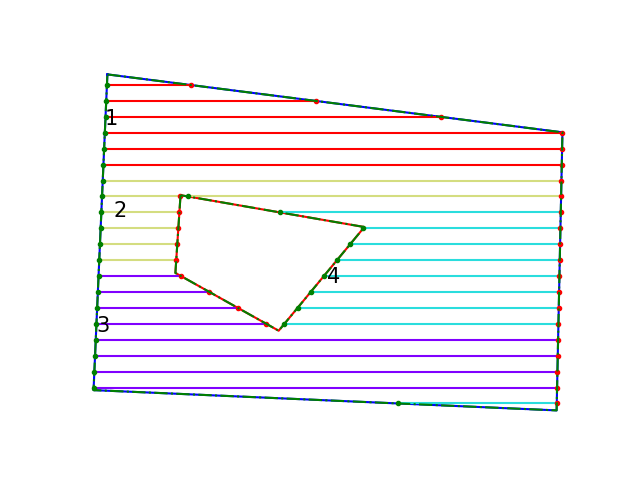
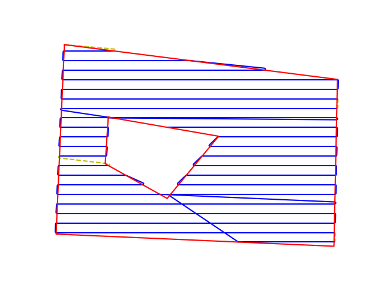

# Summary

Path planning is an important aspect of robotics where the goal is to determine a suitable path in space while satisfying certain conditions. In coverage path planning, the goal is to find a path that traverses through every cell or node in a given region of interest. It has many diverse applications in robotics such as cleaning, agriculture, and search and rescue. This repository contains software to generate guidance trajectories that enable the robot to cover the specified region of interest using boustrophedon or lawn-mower motions [@choset1998coverage], which is a standard method for full coverage. If the area of interest is large or if it has any forbidden regions or obstacles, it could be divided into smaller sections and covered one after the other. The order of visits to the sections is optimized using a TSP solver to minimize the overall distance. The distance between the parallel tracks, and the driving angle, which is the fixed angle of the tracks, can be selected as per the requirements of the specific application.  

# Brief software description

{ width=50% }
{ width=50% }

The path planning algorithm utilized in this software repository was initially presented in @hameed2013optimized. The program takes any field or region of interest as input, that is described using the coordinates of vertices on its boundaries. The perimeter of any obstacle regions, if present, is also included in the input file containing the coordinates. Firstly, the perimeter from the field inputs and collision-free margins, or headlands for agricultural use, are generated around the perimeter. The trajectory for full coverage comprises parallel tracks separated by a certain width that is selected according to the specific operation. These parallel tracks are generated first with the driving angle with respect to the longitudinal axis, and the distance between tracks as parameters. The driving angle could further be optimized to generate trajectories with the minimum overall length. Parallel tracks that compose the total trajectory are generated for the given field of interest, based on the input parameters. If the field is large or has obstacle regions in it that should be avoided, the region could be divided into several sections. The number of sections into which the area is divided can also be passed as a parameter. Each section is visited one after the other and this order is optimized using a traveling salesman problem (TSP) solver [@goulart2021simple]. \autoref{fig:example1} shows the generated tracks for a sample AoI which is also divided into 4 sections. The final trajectory is generated by connecting the individual tracks in the optimized order. Dubins curves are used to join waypoints in this process to ensure that a smooth trajectory is generated [@sakai2018pythonrobotics]. The radius of Dubins curves is also a parameter that can be changed to suit the needs of the specific application or dynamic constraints of the vehicle. Finally, the full path is generated and the list of waypoints of latitude-longitude coordinates that describe this trajectory is returned. \autoref{fig:example2} depicts the full trajectory for the sample AoI.

<!-- # Mathematics

Single dollars ($) are required for inline mathematics e.g. $f(x) = e^{\pi/x}$

Double dollars make self-standing equations:

$$\Theta(x) = \left\{\begin{array}{l}
0\textrm{ if } x < 0\cr
1\textrm{ else}
\end{array}\right.$$

You can also use plain \LaTeX for equations
\begin{equation}\label{eq:fourier}
\hat f(\omega) = \int_{-\infty}^{\infty} f(x) e^{i\omega x} dx
\end{equation}
and refer to \autoref{eq:fourier} from text.

# Citations

Citations to entries in paper.bib should be in
[rMarkdown](http://rmarkdown.rstudio.com/authoring_bibliographies_and_citations.html)
format.

If you want to cite a software repository URL (e.g. something on GitHub without a preferred
citation) then you can do it with the example BibTeX entry below for @fidgit.

For a quick reference, the following citation commands can be used:
- `@author:2001`  ->  "Author et al. (2001)"
- `[@author:2001]` -> "(Author et al., 2001)"
- `[@author1:2001; @author2:2001]` -> "(Author1 et al., 2001; Author2 et al., 2002)"

# Figures

Figures can be included like this:

and referenced from text using \autoref{fig:example}.

Figure sizes can be customized by adding an optional second parameter:
{ width=20% }

# Acknowledgements

We acknowledge contributions from Brigitta Sipocz, Syrtis Major, and Semyeong
Oh, and support from Kathryn Johnston during the genesis of this project.
 -->
# References